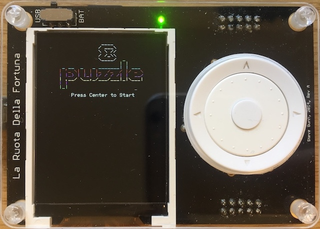
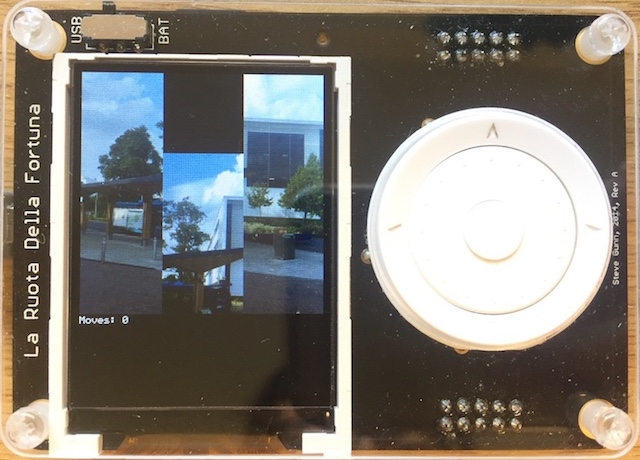
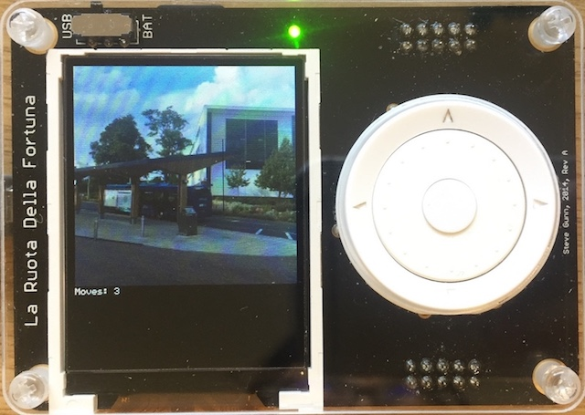
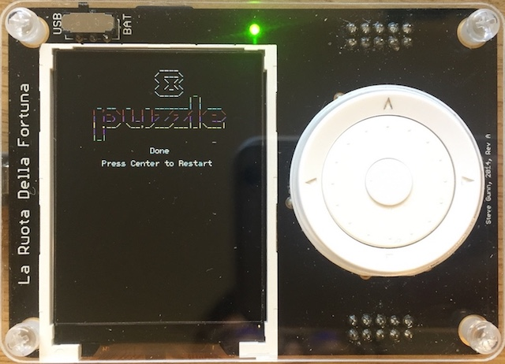

# 8 Puzzle

8 Puzzle game runs on LaFortuna.

## Introduction

Once program starts, press center button to start the game.

An unfinished puzzle of image loaded from SD card will be shown, press direction buttons to move the tiles adjacent to the blank space.

## Images

Start screen: 

In game: 

Finished game: 

Option to restart: 

## Requirements

240 x 240 pixels 16 bit (5:6:5) BMP image file named `puzzle.bmp` on SD card with FAT file system.

## Future Work
- Allow user to select different puzzle images in the SD card
- Allow user to select different difficulty levels

## Lisence

Project licensed under the [MIT](LICENSE) license.

For libraries used in this project, see their license information in their LICENSE files or header comments.
